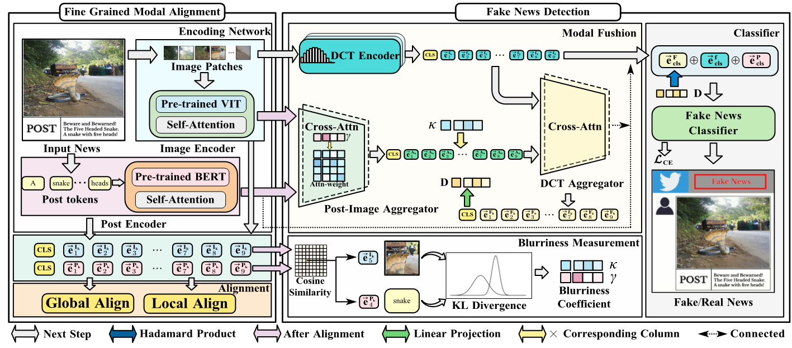

# MHFFD

This is the code for the paper "Cross-modal Ambiguity Learning for Multimodal Fake News Detection".



## Abstract

Detecting fake news on social media has become a crucial task in combating online misinformation and countering malicious propaganda. Existing methods rely on semantic consistency across modalities to fuse features and determine news authenticity. However, cunning  fake news publisher manipulate image to ensure a high level of semantic consistency between the news post and image, making it more difficult to distinguish fake news and posing challenges for existing fake news detection models.

To this end, we propose **MHFFD (Mixed High-Frequency Feature Detector),** a fake news detection framework, which performs fine-grained alignment of image and post. 
This alignment allows us to detect token-level semantic consistency, enabling the identification of key elements within the news and guiding the model in detecting image manipulations within the news content. Extensive experiments demonstrate that MHFFD outperforms state-of-the-art methods on two widely used fake news detection datasets. Furthermore, other research validates the effectiveness of our proposed alignment method, fine-grained semantic consistency measurement, and image manipulation detection.

## Dataset

**The two datasets we used are public datasets, you can obtain the data from corresponding official links.**

We evaluated MHFFD using two widely adopted benchmarks for fake news detection: [Twitter](http://www.multimediaeval.org/mediaeval2016/verifyingmultimediause/index.html) and  [Weibo](https://forms.gle/dsZSLAoLzs93pbp67)

- The Twitter dataset is based on the benchmark released during the MediaEval 2015 evaluation.

- The Weibo dataset was collected from official Weibo debunking systems. Posts verified by the authoritative Chinese news agency, Xinhua News Agency

## Requirement

```
torch
numpy
pickle
transformers
torchvision
scipy
sklearn
nltk
tqdm
```

## Run Code

1. Preprocess

- `cd preprocess`

- `python preprocess.py `

2. Traning

- ` python main.py`

## Experiment Overview

|  Method   | Twitter Acc | Twitter F1 | Weibo Acc | Weibo F1  |
| :-------: | :---------: | :--------: | :-------: | :-------: |
|   EANN    |    0.648    |   0.639    |   0.795   |   0.802   |
|   MAVE    |    0.745    |   0.744    |   0.824   |   0.823   |
|   SAFE    |    0.762    |   0.761    |   0.816   |   0.817   |
| SpotFake  |    0.777    |   0.761    |   0.892   |   0.836   |
| SpotFake+ |    0.790    |   0.788    |   0.870   |   0.871   |
|   MVNN    |    0.784    |   0.779    |   0.823   |   0.822   |
|   CAFE    |    0.806    |   0.806    |   0.840   |   0.840   |
|   MCAN    |   _0.873_   |  _0.865_   |  _0.899_  | **0.899** |
| **MHFFD** |  **0.933**  | **0.928**  | **0.926** |  _0.888_  |
